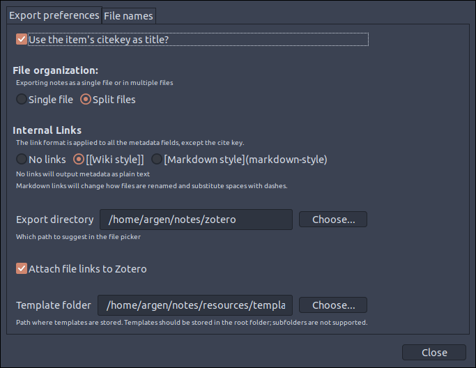

# Configuration

Go to `Tools > Mdnotes preferences`

## File naming convention

In general, I recommend using the `citekey` as title. The exported files will use the prefix and suffix for the type of file being exported, following the pattern `<prefix><title><suffix>.md`.

## File Organization

### Multi-file Exports

Using the `Split files` option will create, as its name indicates, separate files for your metadata, Zotero notes, or your own notes. Whenever you use the `Export to markdown` menu:

* One file containing the metadata will be created if you selected a Zotero item using the [`Zotero Metadata Template`](../../customization/templates.md#zotero-metadata-template).
* If you select a Zotero note, one file will be created using the [`Zotero Note Template`](../../customization/templates.md#zotero-note-template)

Using the `Create Mdnotes file` will create a note for **your** notes using the [`Mdnotes Default Template`](../../customization/templates.md#mdnotes-default-template).

By selecting a Zotero item and using the `Batch export to markdown` menu, mdnotes will create all of the above files, i.e. one for the metadata and one for each Zotero note in that item. If your `Mdnotes` file doesn't exist, it will be created.


**Note:** Your `Mdnotes` file will never be overwritten with the `Batch export` menu. If you wish to do so, you must use the `Create Mdnotes file` and confirm you want to overwrite it.


### Single-file Exports


**Warning!** Single-file exports will replace your existing file **without** asking for confirmation. If you don't want this to happen, you must use [multi-file exports](configuration.md#multi-file-exports).


The `Create full export note` menu exports an item's metadata and its Zotero notes as a single file. For that it uses the `Mdnotes Default Template`, which you should edit by adding your desired metadata placeholders. Zotero notes included in this export will use the `Zotero Note Template`.

The menus for `Export to markdown` and `Create standalone note` behave in the same way as in multi-file exports, and uses their respective templates.


**Note:** The file created with the `Create full export note` menu uses the `Mdnotes Default Template` and the prefix and suffix for `Mdnotes` file.


## Add the created files as linked files to Zotero

If you select the "Attach file links to Zotero", the markdown files will be two clicks away from inside Zotero:

